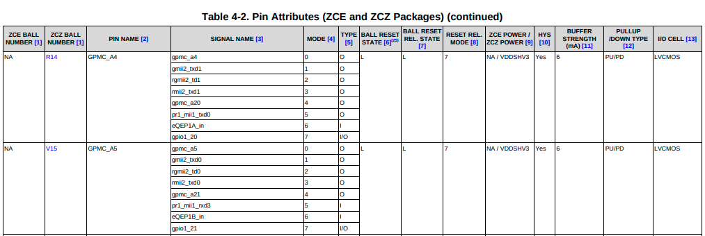

# Devicetree Guide
A devicetree is a tree based data structure containing nodes, which describe the overall system and the physical devices, present on the hardware platform (Beaglebone, RaspberryPi etc).

Both Linux and u-boot follow the same devicetree format to specify the hardware.

## Devicetree basics
#### Format
Here's the basic format of a device tree file.
```
/dts-v1/;

/ {   
      label: node_name@node_address {
          reg = <node_address>;
          property-1 = "xyz";
          property-2 = <2 1>;
          property-3 = 1;
      };

      // rest of the devices
};
~
```
#### Root node
The root node is the starting point of the devicetree's tree structure. It is marked by ```/ {}```. Each devicetree should have a single root node, which contains all other nodes.

#### Device node
A device node has the following format:
```
label: node_name@node_address {
    /* properties */
};
```
The description of the each node element follows.

#### Label
The label of the devicetree nodes help during devicetree compilation. Depending on the context, a label could be used to generate either full ```device node path``` or ```device phandle```.

##### Generating the full devicetree path from label
When a label is referenced with ```&``` in ```aliases``` node or some other device node without ```<>```.

##### Generating the devicetree phandle from label
When a label is referenced with ```&``` inside ```<>```.

See the below example to see both path and phandle generation from the label.
```
ykhan@ykhan:~/uboot$ cat label.dts
/dts-v1/;

/ {
	device_a: device_a {
		property-1 = "xyz";
	};

	device_b {
		device-parent = <&device_a>; // label to phandle
		device-parent-path =  &device_a; // label to fullpath
	};
};

ykhan@ykhan:~/uboot$ # Output a pre-processed dts
ykhan@ykhan:~/uboot$ dtc -O dts label.dts
/dts-v1/;

/ {

	device_a: device_a {
		property-1 = "xyz";
		phandle = <0x1>;
	};

	device_b {
		device-parent = <0x1>;
		device-parent-path = "/device_a";
	};
};
```
#### Node name
The node name serves as an unique identifier for the specfic devicetree node.

#### Node address
The node address is appended to the node name after ```&```. Usually it is equal to the base address of the device registers e.g. ```uart base reg address```.

**The main purpose of the node address is for debugging and other devicetree utilties. For devices without actual base register, the node address can be ommitted or set to some arbitrary unique numerical value.**

#### Phandle
The phandle property of a devicetree node is a numerical identifier, which can be used to reference it node from other devicetree nodes.

**Note: the phandle property is not specified inside the devicetree source files, instead, it is generated automatically by the devicetree compiler during compilation.**

See the above example in sub-section "Label", where ```device_b``` is referring to its parent ```device_a``` via ```device-parent = <0x1>```, where ```<0x1>``` is the phandle of ```device_a```.

#### Properties
A device node can have ```single``` or ```array``` of ```numerical``` and ```string``` properties. Except few standard properties like ```compatible``` and ```status```, the meaning of the rest of the properties depends on a given devicetree binding.

#### Device tree binding
A devicetree binding is a standardized device tree node for a specific device. For example, below is the devicetree binding for the ```STMicroelectronics USART```.
```
* STMicroelectronics STM32 USART

Required properties:
- compatible: can be either:
  - "st,stm32-uart",
  - "st,stm32f7-uart",
  - "st,stm32h7-uart".
  depending is compatible with stm32(f4), stm32f7 or stm32h7.
- reg: The address and length of the peripheral registers space
- interrupts:
  - The interrupt line for the USART instance,
  - An optional wake-up interrupt.
- interrupt-names: Contains "event" for the USART interrupt line.
- clocks: The input clock of the USART instance

Optional properties:
- resets: Must contain the phandle to the reset controller.
- pinctrl-names: Set to "default". An additional "sleep" state can be defined
  to set pins in sleep state when in low power. In case the device is used as
  a wakeup source, "idle" state is defined in order to keep RX pin active.
  For a console device, an optional state "no_console_suspend" can be defined
  to enable console messages during suspend. Typically, "no_console_suspend" and
  "default" states can refer to the same pin configuration.
- pinctrl-n: Phandle(s) pointing to pin configuration nodes.
  For Pinctrl properties see ../pinctrl/pinctrl-bindings.txt
- st,hw-flow-ctrl: bool flag to enable hardware flow control.
- rs485-rts-delay, rs485-rx-during-tx, rs485-rts-active-low,
  linux,rs485-enabled-at-boot-time: see rs485.txt.
- dmas: phandle(s) to DMA controller node(s). Refer to stm32-dma.txt
- dma-names: "rx" and/or "tx"
- wakeup-source: bool flag to indicate this device has wakeup capabilities
- interrupt-names : Should contain "wakeup" if optional wake-up interrupt is
  used.
```
In short, whenever a standardized device tree node is designed for a new device, it is called a device tree binding for that device and all of the properties and their meaning should be documented.

To find the documentation of a certain devicetree binding, ```grep``` the string in the ```compatible``` property, inside the ```doc``` directory of the sources.

*example*
```
ykhan@ykhan:~/uboot$ grep -snr "st,stm32h7-uart" doc/
doc/device-tree-bindings/serial/st,stm32-usart.txt:7:  - "st,stm32h7-uart".
```

#### .dtsi files
By convention, the devicetree source follows a certain hierarchy of devicetree include (.dtsi) and devicetree source (.dts) files. 

The dtsi files contains generic/ common data, that can be shared among many dts files. Each dts file include one or many dtsi files and make changes specific to that dts file. 

A bare minimum example of this heirarchy is the one consisting of a SoC based dtsi file and actual board based board.dts file.

*soc.dtsi*
```
/*
  Define the nodes for all of the available devices on this chipset.
  Mark them disabled by default as not all of them could be supported
  by the actual board, based on this chipset.
*/
```

*board.dts*
```
#include <soc.dtsi>

/*
  Board specific customization to the soc.dtsi i.e.
  1. enable all the devices actually supported on this board
  2. set the board specific parameteres e.g. clock rate, available RAM,
  console uart etc.
*/
```
A dts file could also ```#include``` another dts file, if the board is similar to an existing board. For e.g. consider the below example of ```board_revB```, including the dts file for the previous revision ```board_revA```.
```
/*
    file board_revB.dts
*/

#include <board_revA.dts>

// Changes specific to the board revision B
```

#### Device tree include
When a dtsi file is included in a dts file, the entire content of dtsi file is copied in the dts file. Based on the requirements, the dts file can add, remove, modify or overwrite the nodes defined in the dtsi files.

See the below image for an example of dtsi being included in the board specific dts file.


[Image source](http://wiki.dreamrunner.org/public_html/Embedded-System/Files/DT-inclusion-example.jpg)

**As a general rule of thumb - latter definitions overwrite the earlier ones**

#### Mapping a dts node and its driver
The mapping between a devicetree node and it's corresponding driver is done via compatible string. A devicetree node specifies a ```compatible``` string property, which should also be defined in any driver that handles this device. An easy way to find the drivers for a devicetree device is by simply doing a ```grep``` with the ```compatible``` string inside the source code. It will identify all the drivers/source files, which handle the corrsponding device. For example, consider the below uart dts node.
```
usart2: serial@4000e000 {
    compatible = "st,stm32h7-uart";
    reg = <0x4000e000 0x400>;
    ...
};
```
To find the uart driver handling this device, run the below grep command inside uboot source directory.
```
ykhan@ykhan:~/uboot$ grep -snr "st,stm32h7-uart" drivers/
drivers/serial/serial_stm32.c:221:	{ .compatible = "st,stm32h7-uart", .data = (ulong)&stm32h7_info},
```
The output of the above command shows that the driver source file is drivers/serial/serial_stm32.c.

#### Enabling/disabling a device
To enable/disable a device, the ```status``` property inside a devicetree node is used.

* To enable a device, it should be set as ```status = "okay"```
* To disable a device, it should be set as ```status = "disabled"```

During parsing stage, the devices with ```status``` property set as ```"disabled"``` are skipped and only device with ```status``` set as ```"okay"``` are parsed for further processing.

Moreoever, some of the the SoC devices depending on the pinmux setting (explained later) are disabled in the SoC dtsi file and need to be explicity enabled in the board-specific dts file, based on that SoC.

## Compiling a Devicetree
To compile a devicetree file (.dts), a dtc compiler is used which generates the output devicetree blob file (.dtb).

To install the dtc compiler on ubuntu 18.04.
```
$ apt-get install device-tree-compiler
```

Below is the command to compile an input dts file into an out dtb file.
```
$ dtc -I dts -O dtb -p out.dtb input.dts
```
Similarly, a dtb file can be decompiled into the source dts file via below command. This step can be useful for debugging purposes i.e. to see the final form of the input devicetree file after all the processing and substitutions, before it is compiled.
```
$ dtc -I dtb -O dts -o out.dts input.dtb
```

## Supporting a new board
Normally, a SoC contains many peripherals like ```UART```, ```I2C```, ```SPI``` etc. Each of these peripherals require pins to interface with the physical world. Due to SoC packaging and size constraints, the number of available pins is limited and it might not be possible to allocate pins for all the available peripherals. The solution is ```pin-multiplexing``` or in short ```pinmux```.

#### Pinmux
In pinmux, the SoC's pins are multiplexed between different peripherals or modes. This means that each pin could be connected to a different peripheral based on the pinmux setting. This pin configuration is performed via the ```pinmux controller``` which exposes a register based API to set the mode of the external pins or connect them to one of the internal peripherals.

These pin ```modes``` are commonly referred to as ```alternate functions``` or ```functions``` and a pin could have multiple modes.

For example, see the below snapshot from ```am335x datasheet```: [link](http://www.ti.com/lit/ds/symlink/am3358.pdf)



In the above image, it can be seen that both pins ```GPMC_A4``` and ```GPMC_A5``` can be set into one of the seven available modes ```(0~6)```.

#### SoC specific dtsi file
A SoC dtsi file is a generic file and contains the device nodes for all the peripherals available on the chipset. However, it lacks the board specific information like the pinmux setting. As the pinmux setting depends on each individual board, it is defined in the board-specific dts file.

Furthermore, all the peripherals which need pinmux setting are disabled via ```status = "disabled"``` property in the SoC dtsi file. This makes sense as the the devices need to be explictly enabled in the board-specific dts, after specifying their pinmux setting.

#### The Pinctrl interface
To specify the pinmux setting in the board-specific dts file, both Linux and u-boot has a Pinctrl subsystem. This pinctrl API can be used to set the pinmux setting of each pin. Here are the main parts of ```pinctrl API```.
1. ```pinctrl-provider```
2. ```pinctrl-group```
3. ```pinctrl-client```

##### Pinctrl-provider
The pinctrl provider is a devicetree node for the actual pinmux controller on the chipset. It the devicetree node with node name set as ```pin-controller```. For example, for ```STM32MP1``` chipset:

```
ykhan@ykhan:~/uboot$ head -n 30 arch/arm/dts/stm32mp157-pinctrl.dtsi
// SPDX-License-Identifier: (GPL-2.0+ OR BSD-3-Clause)
/*
 * Copyright (C) STMicroelectronics 2017 - All Rights Reserved
 * Author: Ludovic Barre <ludovic.barre@st.com> for STMicroelectronics.
 */

#include <dt-bindings/pinctrl/stm32-pinfunc.h>

/ {
	soc {
		pinctrl: pin-controller@50002000 {
			#address-cells = <1>;
			#size-cells = <1>;
			compatible = "st,stm32mp157-pinctrl";
			ranges = <0 0x50002000 0xa400>;
			interrupt-parent = <&exti>;
			st,syscfg = <&exti 0x60 0xff>;
			hwlocks = <&hsem 0>;
			pins-are-numbered;

			gpioa: gpio@50002000 {
				gpio-controller;
				#gpio-cells = <2>;
				interrupt-controller;
				#interrupt-cells = <2>;
				reg = <0x0 0x400>;
				clocks = <&rcc GPIOA>;
				st,bank-name = "GPIOA";
				status = "disabled";
			};
```

Each chipset has their own pinctrl provider binding and for above example, the devicetree binding for pinctrl provider has ```compatible = "st,stm32mp157-pinctrl"``` and here is an excerpt from its documentation.

```
ykhan@ykhan:~/uboot$ grep -snr 'st,stm32mp157-pinctrl' doc/
doc/device-tree-bindings/pinctrl/st,stm32-pinctrl.txt:16:   "st,stm32mp157-pinctrl"

ykhan@ykhan:~/uboot$ head -n 20  doc/device-tree-bindings/pinctrl/st,stm32-pinctrl.txt
* STM32 GPIO and Pin Mux/Config controller

STMicroelectronics's STM32 MCUs intregrate a GPIO and Pin mux/config hardware
controller. It controls the input/output settings on the available pins and
also provides ability to multiplex and configure the output of various on-chip
controllers onto these pads.

Pin controller node:
Required properies:
 - compatible: value should be one of the following:
   "st,stm32f429-pinctrl"
   "st,stm32f469-pinctrl"
   "st,stm32f746-pinctrl"
   "st,stm32f769-pinctrl"
   "st,stm32h743-pinctrl"
   "st,stm32mp157-pinctrl"
   "st,stm32mp157-z-pinctrl"
 - #address-cells: The value of this property must be 1
 - #size-cells	: The value of this property must be 1
 - ranges	: defines mapping between pin controller node (parent) to
```
Typically, the pinmux functionality is performed by the ```GPIO``` controller i.e. in addition to setting the ```pin I/O mode```, the ```GPIO``` registers can be used to select the pin mode as well. Therefore, its common for the ```GPIO``` controller to be the child of ```pin-contoller``` node.

##### Pinctrl-group
A ```pinctrl-group``` is a child node of the ```pin-controller``` node, and represents the mode of a single or group of pins. The format of the ```pinctrl-group``` is specified by its parent ```pin-controller``` device binding. In case of our current ```STM32MP1``` example, it is defined as:
```
Contents of function subnode node:
----------------------------------
Subnode format
A pinctrl node should contain at least one subnode representing the
pinctrl group available on the machine. Each subnode will list the
pins it needs, and how they should be configured, with regard to muxer
configuration, pullups, drive, output high/low and output speed.

node {
	 pinmux = <PIN_NUMBER_PINMUX>;
   GENERIC_PINCONFIG;
};

Required properties:
- pinmux: integer array, represents gpio pin number and mux setting.
  Supported pin number and mux varies for different SoCs, and are defined in
  dt-bindings/pinctrl/<soc>-pinfunc.h directly.
  These defines are calculated as:
    ((port * 16 + line) << 8) | function
  With:
    - port: The gpio port index (PA = 0, PB = 1, ..., PK = 11)
    - line: The line offset within the port (PA0 = 0, PA1 = 1, ..., PA15 = 15)
    - function: The function number, can be:
      * 0 : GPIO
      * 1 : Alternate Function 0
      * 2 : Alternate Function 1
      * 3 : Alternate Function 2
      * ...
      * 16 : Alternate Function 15
      * 17 : Analog

  To simplify the usage, macro is available to generate "pinmux" field.
  This macro is available here:
    - include/dt-bindings/pinctrl/stm32-pinfunc.h
...
Optional properties:
- GENERIC_PINCONFIG: is the generic pinconfig options to use.
  Available options are:
   - bias-disable,
   - bias-pull-down,
   - bias-pull-up,
   - drive-push-pull,
   - drive-open-drain,
   - output-low
   - output-high
   - slew-rate = <x>, with x being:
       < 0 > : Low speed
       < 1 > : Medium speed
       < 2 > : Fast speed
       < 3 > : High speed
```
In general, a ```pin-controller``` can have many `pinctrl-groups`, even for the same pins. The presence of ```pinctrl-groups``` under ```pin-controller``` doesn't mean it is activated i.e.  it doesn't reflect the actual mode of the pins. It just serves as a ``pool`` of all the possible pinmux combinations.

In order to activate a specific ```pinctrl-group```, it must be requested by a ```pinctrl-client``` device node. Here's the example of three ```pinctrl-groups``` to be reserved for the ```UART4``` device on ```STM32MP1``` platform. These groups correspond to the ```normal```, ```idle``` and ```sleep``` state of the ```UART4``` peripheral.
```
uart4_pins_a: uart4-0 {
    pins1 {
        pinmux = <STM32_PINMUX('G', 11, AF6)>; /* UART4_TX */
        bias-disable;
        drive-push-pull;
        slew-rate = <0>;
    };
    pins2 {
        pinmux = <STM32_PINMUX('B', 2, AF8)>; /* UART4_RX */
        bias-disable;
    };
};

uart4_idle_pins_a: uart4-idle-0 {
    pins1 {
        pinmux = <STM32_PINMUX('G', 11, ANALOG)>; /* UART4_TX */
    };
    pins2 {
        pinmux = <STM32_PINMUX('B', 2, AF8)>; /* UART4_RX */
        bias-disable;
    };
};

uart4_sleep_pins_a: uart4-sleep-0 {
    pins {
        pinmux = <STM32_PINMUX('G', 11, ANALOG)>, /* UART4_TX */
                <STM32_PINMUX('B', 2, ANALOG)>; /* UART4_RX */
        };
};
```
##### Pinctrl-client
The `pinctrl-client` is a device node, which activates a `pinctrl-group` configuration via it's ```pinctrl-<num>``` property. The ```pinctrl-X``` refers to the ```phandle``` of the ```pinctrl-group```, which is specified by referring to the ```label``` of the corresponding ```pinctrl-group```. *See generating the phandle from label under the section "Label" above*.

 Usually the ```pinctrl-0``` is the default ```pinctrl-group```, that is activated as soon the driver for the `pinctrl-client` device loads (```probe``` method of the driver is called). A device may activate more than single ```pinctrl-group```, one for each different state. Therefore, it has to specify list of all the possible pinmux settings it might require via ```pinctrl-1```, ```pinctrl-2``` upto```pinctrl-N``` properties. The number ```N``` depends on the number of states of the ```pinctrl-client``` driver.

Building up on the current ```STM32MP1``` example, here's the ```pinctrl-client``` node for the ```UART4```, requesting three ```pin-groups```, one for each ```normal```, ```idle``` and ```sleep``` state.
```
&uart4 {
        pinctrl-names = "default", "sleep", "idle", "no_console_suspend";
        pinctrl-0 = <&uart4_pins_a>;
        pinctrl-1 = <&uart4_sleep_pins_a>;
        pinctrl-2 = <&uart4_idle_pins_a>;
        pinctrl-3 = <&uart4_pins_a>;
        status = "okay";
};
```
Notice the ```pinctrl-names``` property above, this creates a mapping between a human readable string and a ```pinctrl``` id. For example, the driver can use string ```"sleep"```, to activate the ```pinctrl-1``` setting. For example, here is the function call in u-boot to activate the ```pinctrl-0``` ```pinctrl-group``` by using the string ```"default"```.
```
// in function device_probe() in file drivers/core/device.c
pinctrl_select_state(dev, "default");
```
#### Adding pinctrl-groups
In most cases, the ```pinctrl-groups``` defined under the ```pin-controller``` node should be sufficient. However, if the existing ```pinctrl-groups``` do not meet the requirement and a new ```pinctrl-group``` is needed, it can be done by adding a new ```pinctrl-group``` to the ```pin-controller``` in the board-specific dts file as follows.
```
&pinctrl {
    pinctrl-group-custom_1: custom_pins_1 {
        // additional pinctrl-group
    };

    pinctrl-group-custom_2: custom_pins_2 {
        // additional pinctrl-group
    };

    pinctrl-group-custom_3: custom_pins_3 {
        // additional pinctrl-group
    };
};
```
While adding extra ```pinctrl-groups```, make sure the same pins are not being in any other ```pinctrl-group```. Otherwise it could cause a conflict and the pins could be in the unexpected mode, if any two different ```pinctrl-client``` devices activate the conflicting ```pinctrl-groups```. At times,it might be required to explicity ```disable``` the device node making use of the conflicting ```pinctrl-groups```.

#### Enabling a device
As mentioned above, the SoC specific dtsi files contains many devices which are ```disabled``` by default because they depend on the final pinmux setting in the board-specific dts file.

After finalizing the pinmux setting, the device can be enabled in the board specific file by specifying the ```pinctrl-group``` and setting the ```status``` property in the following way.
```
&device_label_from_soc_dtsi {
    pinctrl-0 = <&required_pinctrl-group-label>;
    status = "okay";
};
```
Repeating the earlier example of ```UART4``` here.
```
&uart4 {
        pinctrl-names = "default;
        pinctrl-0 = <&uart4_pins_a>;
        status = "okay";
};
```

#### Setting the static pinmux state
As mentioned earlier, a ```pinctrl-group``` becomes active only as the corresponding ```pinctrl-client``` device driver loads (driver's probe is called) and remains inactive otherwise.

In other words, the system's pinmux state depends on which drivers have been loaded or activated.

If there's a requirement that system pins need to be in a certain default state on boot, irrespective of the number of drivers loaded, then there is a little trick for it.

This can be done by defining a new ```pinctrl-group``` that consists of all the static pins and setting the ```pin-controller``` node as the ```pinctrl-client``` of itself. For example:
```
&pinctrl {
    // set pinctrl as client to itself
    pinctrl-names = "default";
    pinctrl-0 = <&static_pins_grp>;

    static_pins_grp: static_pins {
        // define pins
    };
};
```
This will ensure that the pins are set to the mode specified by ```static_pins_grp``` on system boot.
